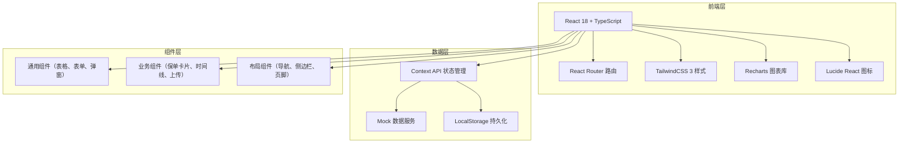
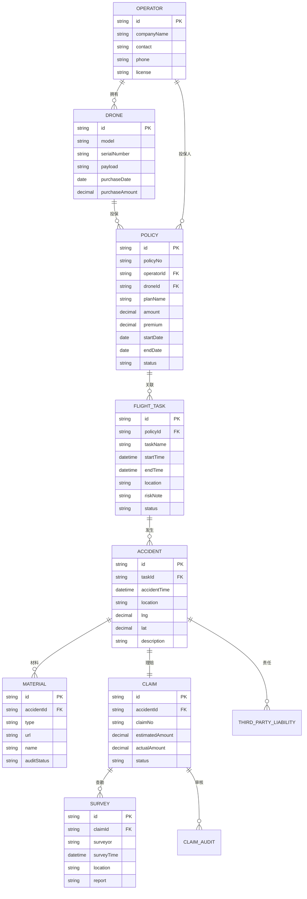

## 1. 架构设计



## 2. 技术说明

- **前端框架**：React@18 + TypeScript@5 + Vite@5
- **样式方案**：TailwindCSS@3 + PostCSS
- **路由管理**：React Router DOM@6
- **图表库**：Recharts@2（统计台账页面图表）
- **图标库**：Lucide React
- **状态管理**：React Context API
- **UI 组件**：自定义业务组件 + TailwindCSS 原子化样式
- **数据方案**：本地 Mock 数据 + LocalStorage 持久化
- **构建工具**：Vite@5

## 3. 路由定义

| 路由路径 | 页面名称 | 说明 |
|----------|----------|------|
| / | 首页/仪表盘 | 数据概览、快捷入口、待办提醒 |
| /insurance/apply | 投保申请 | 机型登记、方案比选、在线报价、投保单 |
| /insurance/policies | 保单管理 | 保单列表、详情、批量投保、续期 |
| /flight/tasks | 飞行任务关联 | 任务列表、创建、风险备注、保单绑定 |
| /accident/report | 事故报案 | 事故定位、损失清单、第三方责任 |
| /accident/materials | 材料收集 | 照片视频上传、证件提交、审核状态 |
| /claims/survey | 查勘协同 | 查勘预约、记录、补充通知 |
| /claims/progress | 赔付进度 | 赔付测算、审核流程、结案确认 |
| /statistics | 统计台账 | 数据看板、保单统计、理赔分析、争议记录 |

## 4. 数据模型

### 4.1 数据模型定义



### 4.2 Mock 数据结构

```typescript
// 无人机机型
interface Drone {
  id: string;
  model: string;
  serialNumber: string;
  payload: string;
  purchaseDate: string;
  purchaseAmount: number;
  status: 'active' | 'insured' | 'damaged';
}

// 保单
interface Policy {
  id: string;
  policyNo: string;
  operatorName: string;
  droneModel: string;
  droneId: string;
  planName: string;
  coverageAmount: number;
  premium: number;
  startDate: string;
  endDate: string;
  status: 'active' | 'expired' | 'pending' | 'renewal';
}

// 飞行任务
interface FlightTask {
  id: string;
  taskName: string;
  policyId: string;
  policyNo: string;
  startTime: string;
  endTime: string;
  location: string;
  riskLevel: 'low' | 'medium' | 'high';
  riskNote: string;
  status: 'scheduled' | 'in_progress' | 'completed' | 'cancelled';
}

// 事故报案
interface Accident {
  id: string;
  reportNo: string;
  taskId: string;
  accidentTime: string;
  location: string;
  lng: number;
  lat: number;
  description: string;
  lossItems: LossItem[];
  thirdParties: ThirdParty[];
  status: 'reported' | 'surveying' | 'auditing' | 'settled' | 'closed';
}

// 损失清单
interface LossItem {
  id: string;
  type: 'drone' | 'payload' | 'other';
  name: string;
  quantity: number;
  unitPrice: number;
  damageDegree: 'minor' | 'moderate' | 'severe' | 'total';
}

// 第三方责任
interface ThirdParty {
  id: string;
  type: 'person' | 'property';
  name: string;
  description: string;
  estimatedLoss: number;
}

// 赔案
interface Claim {
  id: string;
  claimNo: string;
  accidentId: string;
  reportNo: string;
  estimatedAmount: number;
  actualAmount: number;
  surveyor: string;
  surveyTime: string;
  auditNodes: AuditNode[];
  status: 'pending' | 'surveying' | 'auditing' | 'approved' | 'paid' | 'closed' | 'disputed';
}

// 审核节点
interface AuditNode {
  id: string;
  name: string;
  role: string;
  status: 'pending' | 'current' | 'completed';
  time?: string;
  comment?: string;
}
```

## 5. 目录结构

```
src/
├── assets/              # 静态资源
├── components/          # 通用组件
│   ├── layout/         # 布局组件
│   ├── ui/             # 基础UI组件
│   └── business/       # 业务组件
├── contexts/           # Context 状态管理
├── data/               # Mock 数据
├── hooks/              # 自定义 Hooks
├── pages/              # 页面组件
│   ├── Dashboard.tsx
│   ├── insurance/
│   │   ├── Apply.tsx
│   │   └── Policies.tsx
│   ├── flight/
│   │   └── Tasks.tsx
│   ├── accident/
│   │   ├── Report.tsx
│   │   └── Materials.tsx
│   ├── claims/
│   │   ├── Survey.tsx
│   │   └── Progress.tsx
│   └── statistics/
│       └── Index.tsx
├── types/              # TypeScript 类型定义
├── utils/              # 工具函数
├── App.tsx
├── main.tsx
└── index.css
```
